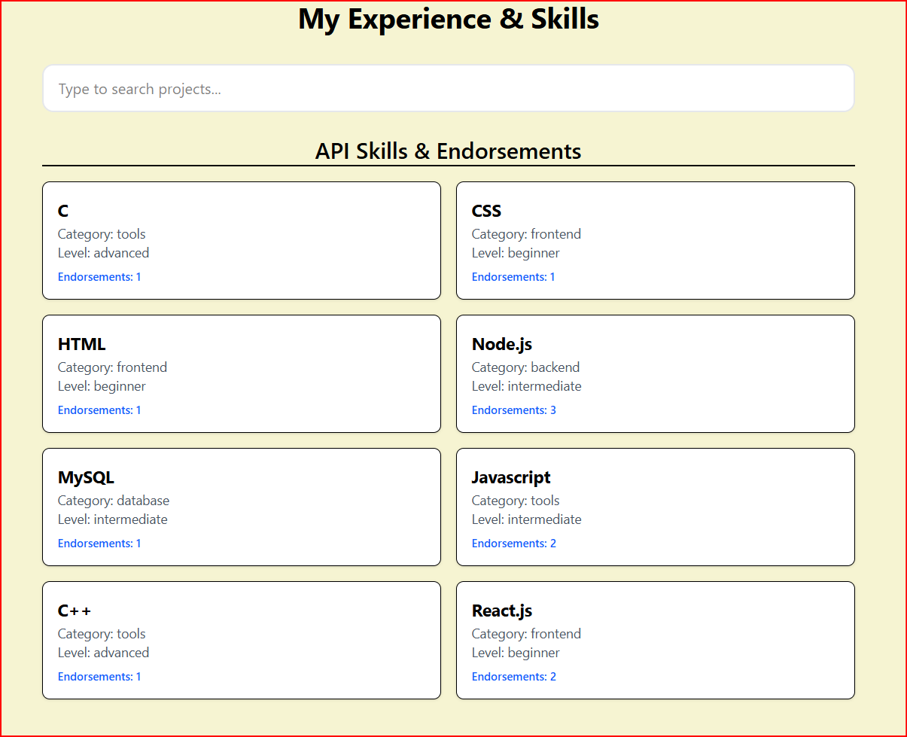

# Portfolio Skills API

A full-stack skills management system built for my portfolio. Visitors can browse and search skills, logged-in users can endorse a skill once, and administrative actions (creating, updating, or deleting skills) are strictly restricted to the admin role. Data is persisted in MongoDB Atlas to survive redeployments.

---

## 📽️ Demo & Screenshots

[](https://www.loom.com/share/62dc1e437a614c9783b4621f9df7db2b)  
*Click above to watch the Loom Video walkthrough of the Final Capstone.*



---

## 🌐 Live Links

* **Frontend App:** [https://final-frontend-zeta-one.vercel.app](https://final-frontend-zeta-one.vercel.app)
* **API Health Check:** [https://final-backend-ga8z.onrender.com/api/health](https://final-backend-ga8z.onrender.com/api/health)
* **GitHub Repository:** [https://github.com/203mcgee/Final-Capstone](https://github.com/203mcgee/Final-Capstone.git)

> **Note on Free Hosting:** The backend API runs on Render's free tier. The initial request after an idle period may take 45–60 seconds to spin up from sleep mode.

---

## 🛠️ Tech Stack

* **Frontend:** React, Vite, React Router, Tailwind CSS *(Hosted on Vercel)*
* **Backend:** Node.js, Express *(Hosted on Render)*
* **Database:** MongoDB Atlas with Mongoose
* **Auth & Security:** bcrypt, JSON Web Tokens (JWT), Zod, Helmet, express-rate-limit, CORS

---

## ✨ Features

* **Custom Atomic IDs:** Skills stored in MongoDB use human-readable custom IDs (`SKL-0001`) managed via an atomic counter document.
* **Server-Side Search & Sort:** Query filtering and sorting (`search`, `category`, `level`, `sort`) processed directly within database queries.
* **JWT Authentication:** Visitor registration and login with bcrypt password hashing and 1-hour JWT tokens.
* **Atomic Endorsements:** Prevents duplicate voting using MongoDB atomic `$addToSet` and `$inc` updates (1 endorsement per user per skill).
* **Admin Authorization:** Protected endpoints for full CRUD operations enforced by role-based middleware (`requireAuth`, `requireAdmin`).
* **UX & Accessibility:** Complete handling for loading, error, and empty states across data tables with accessible input labels.

---

## 🚀 Local Setup & Installation

### Prerequisites
* Node.js (v18+)
* MongoDB Atlas instance or local MongoDB instance

### 1. Clone & Set Up Backend

```bash
git clone [https://github.com/203mcgee/Final-Capstone.git](https://github.com/203mcgee/Final-Capstone.git)
cd Final-Capstone

# Navigate to Server
cd server
npm install

# Configure Environment Variables
cp .env.example .env