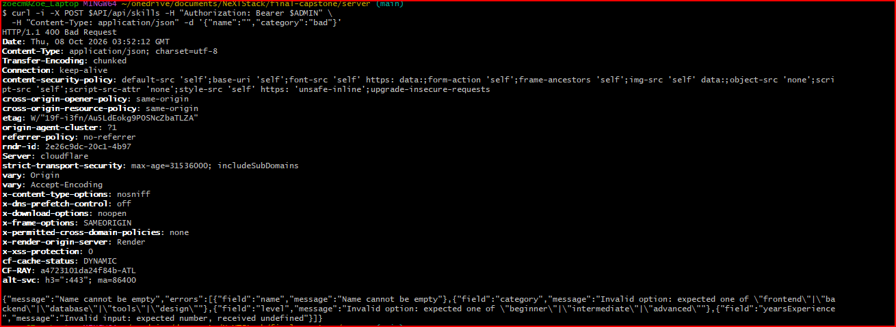
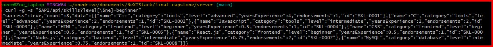
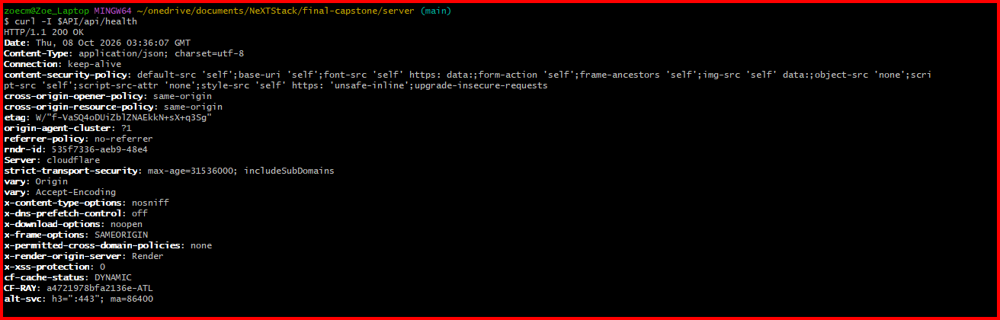
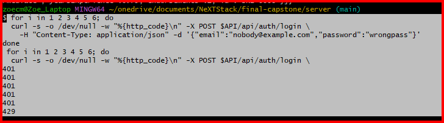
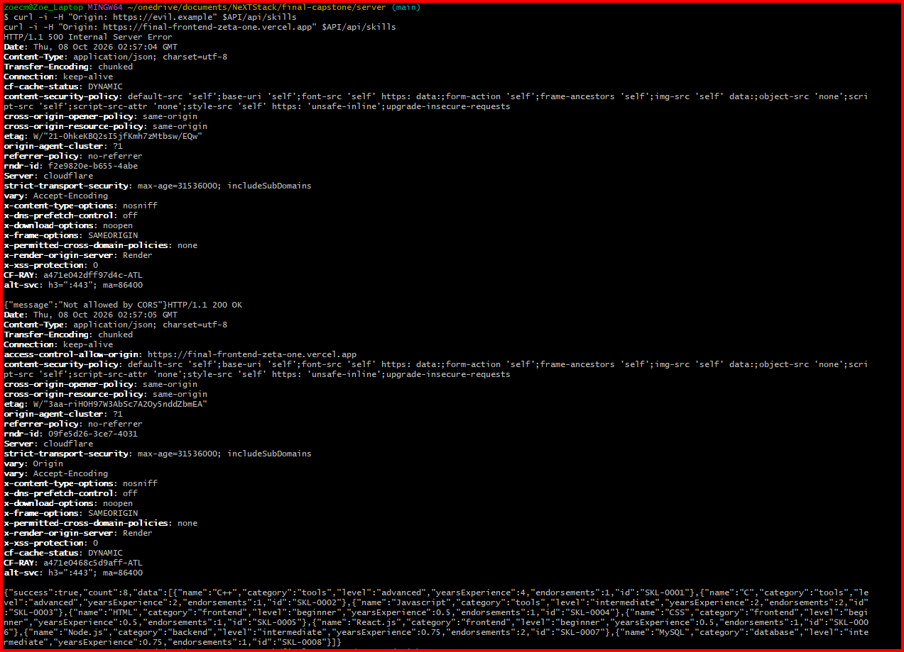
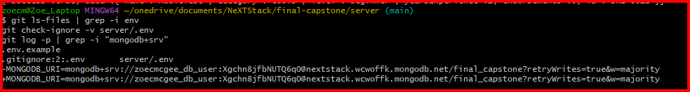
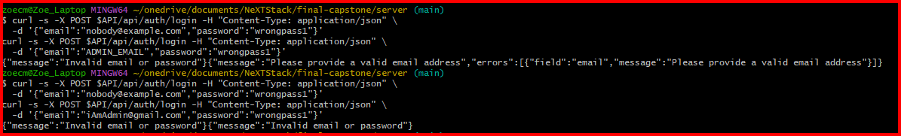

# Security Audit

Project: Skills API (Option C)
API: https://final-backend-ga8z.onrender.com
Date of audit: 10/08

Each check has a status, the command or screenshot used as evidence, and what I saw. Evidence files live in `docs/evidence/`.

## Summary

| # | Check | Status |
|---|---|---|
| 1 | Zod validates every request body | ☐ Pass ☐ Fail |
| 2 | `sanitizeFilter` blocks operator injection | ☐ Pass ☐ Fail |
| 3 | SQL placeholders | **N/A** (no PostgreSQL stretch) |
| 4 | Helmet is first middleware | ☐ Pass ☐ Fail |
| 5 | Login rate limit (5 per 15 min, then 429) | ☐ Pass ☐ Fail |
| 6 | CORS limited to `CLIENT_URL` | ☐ Pass ☐ Fail |
| 7 | Least-privilege Atlas database user | ☐ Pass ☐ Fail |
| 8 | No secrets in the repo or history | ☐ Pass ☐ Fail |
| 9 | Passwords hashed, no hash in responses, generic login error | ☐ Pass ☐ Fail |
| 10 | Authorization: 401 vs 403, role never from the body | ☐ Pass ☐ Fail |

## Setup for the commands

Run these in Git Bash. Log in as admin and as a visitor first, and copy each token.

```bash
API=https://final-backend-ga8z.onrender.com

curl -s -X POST $API/api/auth/login -H "Content-Type: application/json" \
  -d '{"email":"ADMIN_EMAIL","password":"ADMIN_PASSWORD"}'
# copy the "token" value
ADMIN="paste-admin-token"
USER="paste-visitor-token"
```
"token":"eyJhbGciOiJIUzI1NiIsInR5cCI6IkpXVCJ9.eyJ1c2VySWQiOiI2YWM3MDIwMzdmMzAwY

---

## 1. Zod validates every request body

Expected: bad input returns 400 with a message, and unknown fields are stripped.

```bash
curl -i -X POST $API/api/skills -H "Authorization: Bearer $ADMIN" \
  -H "Content-Type: application/json" -d '{"name":"","category":"bad"}'
```

- Status: ☐ Pass 
- Evidence: ____
- Notes: ____



## 2. `sanitizeFilter` blocks operator injection

Expected: an object sent where a string belongs is rejected or treated as a literal, never run as a query operator.

```bash
curl -i -X POST $API/api/auth/login -H "Content-Type: application/json" \
  -d '{"email":{"$gt":""},"password":"x"}'
```

I also confirmed `mongoose.set('sanitizeFilter', true)` is in `server.js`.

- Status: ☐ Pass 
- Evidence: ____
- Notes: ____


## 3. SQL placeholder check

**N/A.** This project uses MongoDB only. I did not do the PostgreSQL stretch goal.

## 4. Helmet

Expected: security headers such as `x-content-type-options` and `strict-transport-security`, and no `x-powered-by`. `helmet()` is the first `app.use` in `server.js`.

```bash
curl -I $API/api/health
```

- Status: ☐ Pass 
- Evidence: ____


## 5. Login rate limit

Expected: five 401s, then 429 on the sixth try.

```bash
for i in 1 2 3 4 5 6; do
  curl -s -o /dev/null -w "%{http_code}\n" -X POST $API/api/auth/login \
    -H "Content-Type: application/json" -d '{"email":"nobody@example.com","password":"wrongpass"}'
done
```

Note: this blocks logins from my IP for 15 minutes, so I ran it last.

- Status: ☐ Pass 
- Evidence: ____



## 6. CORS limited to `CLIENT_URL`

Expected: the response includes `Access-Control-Allow-Origin` for my Vercel URL and not for any other origin.

```bash
curl -i -H "Origin: https://evil.example" $API/api/skills
curl -i -H "Origin: https://final-frontend-zeta-one.vercel.app" $API/api/skills
```

- Status: ☐ Pass 
- Evidence: ____


## 7. Least-privilege Atlas user

Expected: the app's database user has only the `readWrite` role on `final_capstone`, and is not an Atlas admin or `atlasAdmin`.

- Status: ☐ Pass ☐ Fail
- Evidence: screenshot of Atlas, Database Access, with the user's role visible: ____

## 8. No secrets in the repo or history

```bash
git ls-files | grep -i env
git check-ignore -v server/.env
git log -p | grep -i "mongodb+srv"
```

Expected: only `.env.example` files are tracked, `.env` is ignored, and the last command prints nothing.

- Status:  ☐ Fail
- Evidence: ____
- Incident note: on Oct 3, 2026 a real database connection string was committed in `server/.env.example` (commit 2d399c8). I rotated the Atlas database password on ____ and updated Render, so the exposed credential no longer works. The old string is still visible in git history.


## 9. Passwords and login responses

Expected:
- Passwords are hashed with bcrypt at cost 12 (`/register` and `scripts/seed.js`).
- No response includes `passwordHash`.
- A wrong email and a wrong password return the same message, "Invalid email or password".

```bash
curl -s -X POST $API/api/auth/login -H "Content-Type: application/json" \
  -d '{"email":"nobody@example.com","password":"wrongpass1"}'
curl -s -X POST $API/api/auth/login -H "Content-Type: application/json" \
  -d '{"email":"ADMIN_EMAIL","password":"wrongpass1"}'
```

- Status: ☐ Pass 
- Evidence: ____


## 10. Authorization and role handling

Expected: no token returns 401, a visitor token on an admin route returns 403, and a `role` sent at registration is ignored.

```bash
curl -i -X DELETE $API/api/skills/SKL-0001
curl -i -X DELETE $API/api/skills/SKL-0001 -H "Authorization: Bearer $USER"
curl -s -X POST $API/api/auth/register -H "Content-Type: application/json" \
  -d '{"email":"audit-test@example.com","password":"secret123","role":"admin"}'
```

For the last command, the returned `user.role` should be `user`.

- Status: ☐ Pass 
- Evidence: ____

---

## Known issues and fixes

List anything marked Fail here, with the fix and the date it was fixed.

| Check | Problem | Fix | Date |
|---|---|---|---|
| | | | |
